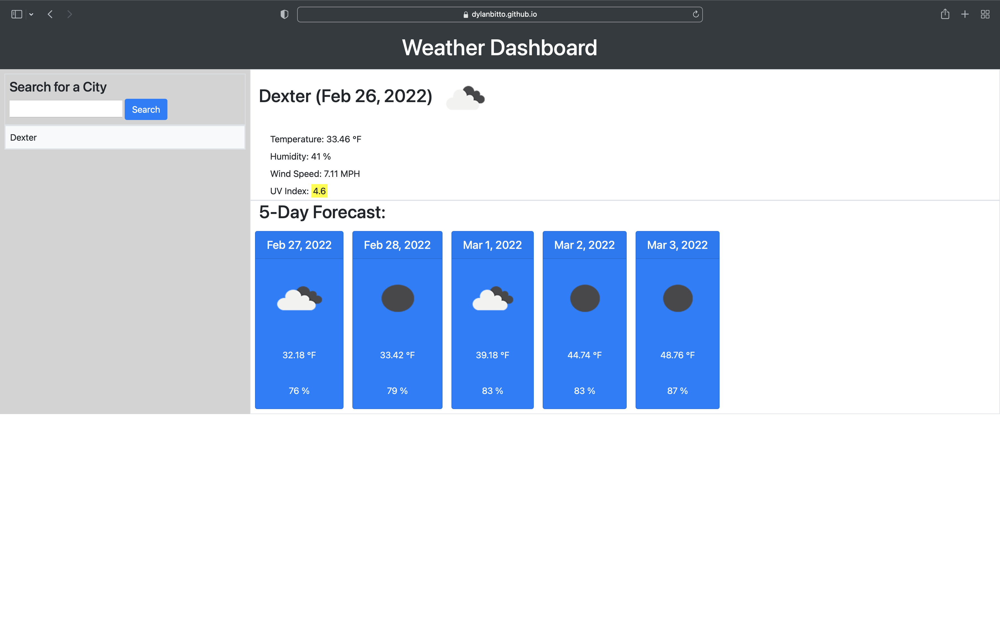

# Weather Dashboard

## Purpose
A web-based dashboard built to show the current weather in a city of choice and the upcoming five day forecast for that city

Enter in your city of choice and select search to view the current weather, temperature, humidity, wind speed, and UV Index for that city at the current time.

Previous searches are saved in localStorage and the five most recent searches are available as buttons in order for easy access and re-searching of weather and forecasts

## Built With 
* HTML
* CSS
* Javascript
* Open Weather API
* Moment.js API
* Bootstrap API

## Website
https://dylanbitto.github.io/Ultra-instinct/

# Github Username
Dylanbitto

# Github Email
dylanbitto5425@gmail.com